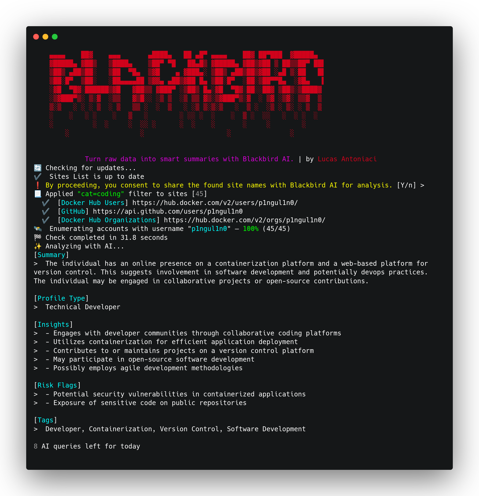

# Blackbird

<figure><figcaption></figcaption></figure>

> Blackbird is a powerful OSINT tool that combines fast username and email searches across more than 600 platforms with free AI-powered profiling. By leveraging community-driven projects like WhatsMyName, it ensures low false positive rates and high-quality results. Features include smart filters, polished PDF/CSV exports, and fully automated analysis — all from a single CLI.

[](https://cutt.ly/frtVNzQQ)

### Setup

**Clone the repository**

```bash
git clone https://github.com/p1ngul1n0/blackbird
cd blackbird
```

**Install requirements**

```bash
pip install -r requirements.txt
```

### Usage

**Search by username**

```bash
python blackbird.py --username johndoe
```

**Search by email**

```bash
python blackbird.py --email johndoe@example.com 
```

**Export results to PDF**

```bash
python blackbird.py --email  --pdf
```

##  ✨ AI (Free)
Blackbird integrates an AI engine that analyzes the sites where a username or email is found and returns a behavioral and technical profile of the user — helping you understand more, with less effort.

- No sensitive data is shared — only site names are sent

- Usage is completely free, with a fair daily limit

- AI results are also included in PDF exports (```--pdf```)
#### Generate an API key:
```bash
python blackbird.py --setup-ai
```
#### Use it
```bash
python blackbird.py --username johndoe --ai
```

## More
For more details about the project, visit the <a href="https://p1ngul1n0.gitbook.io/blackbird/">Docs</a>

### Project Developer

[Lucas Antoniaci](https://www.linkedin.com/in/lucas-antoniaci/)

### WhatsMyName

Blackbird is fully integrated with [WhatsMyName](https://github.com/WebBreacher/WhatsMyName) project, witch has 600+ sites to perform accurate reverse username search.

### Sponsors

[](https://www.digitalocean.com/?refcode=eae02be1dd10&utm_campaign=Referral_Invite&utm_medium=Referral_Program&utm_source=badge)

### Disclaimer

```
This or previous program is for Educational purpose ONLY. Do not use it without permission. 
The usual disclaimer applies, especially the fact that me (P1ngul1n0) is not liable for any 
damages caused by direct or indirect use of the information or functionality provided by these 
programs. The author or any Internet provider bears NO responsibility for content or misuse 
of these programs or any derivatives thereof. By using these programs you accept the fact 
that any damage (dataloss, system crash, system compromise, etc.) caused by the use of these 
programs is not P1ngul1n0's responsibility.
```
