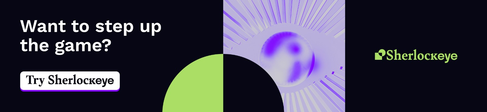

# Blackbird

<figure><figcaption></figcaption></figure>

> Blackbird is a robust OSINT tool that facilitates rapid searches for user accounts by username or email across a wide array of platforms, enhancing digital investigations. It features WhatsMyName integration, export options in PDF, CSV, and HTTP response formats, and customizable search filters.

[](https://cutt.ly/frtVNzQQ)

### Setup

**Clone the repository**

```bash
git clone https://github.com/p1ngul1n0/blackbird
cd blackbird
```

**Install requirements**

```bash
pip install -r requirements.txt
```

### Usage

**Search by username**

```bash
python blackbird.py --username username1 username2 username3
```

**Search by email**

```bash
python blackbird.py --email email1@email.com email2@email.com email3@email.com
```

**Export results to PDF**

```bash
python blackbird.py --email email1@email.com --pdf
```

##  ✨ AI
Blackbird uses AI-powered NER models to improve metadata extraction, identifying key entities for faster and more accurate insights.
```bash
python blackbird.py --username username1 --ai
```

## More
For more details about the project, visit the <a href="https://p1ngul1n0.gitbook.io/blackbird/">Docs</a>

### Project Developer

[Lucas Antoniaci](https://www.linkedin.com/in/lucas-antoniaci/) [](https://raw.githubusercontent.com/stevenrskelton/flag-icon/master/png/16/country-4x3/br.png)

### WhatsMyName

Blackbird is fully integrated with [WhatsMyName](https://github.com/WebBreacher/WhatsMyName) project, witch has 600+ sites to perform accurate reverse username search.

### Sponsors


<p align="center">
  
  [](https://www.digitalocean.com/?refcode=eae02be1dd10&utm_campaign=Referral_Invite&utm_medium=Referral_Program&utm_source=badge)
  
  <a href="https://site.cyberhunteracademy.com/">
    
  </a>
</p>

### Disclaimer

```
This or previous program is for Educational purpose ONLY. Do not use it without permission. 
The usual disclaimer applies, especially the fact that me (P1ngul1n0) is not liable for any 
damages caused by direct or indirect use of the information or functionality provided by these 
programs. The author or any Internet provider bears NO responsibility for content or misuse 
of these programs or any derivatives thereof. By using these programs you accept the fact 
that any damage (dataloss, system crash, system compromise, etc.) caused by the use of these 
programs is not P1ngul1n0's responsibility.
```
