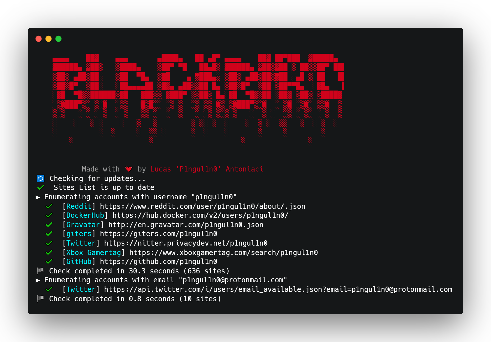

# Blackbird

<figure><figcaption></figcaption></figure>

## What is it?

Blackbird is an advanced Open Source Intelligence (OSINT) tool designed for rapid and thorough searches of user accounts by username or email across a vast array of platforms.

#### Key Features:

* **Username and Email Search**: Efficiently searches for user accounts by username or email on numerous websites.
* **Metadata Extraction**: Effortlessly gather essential details from discovered accounts, including names, locations, pictures, and more. This feature ensures you have comprehensive information readily available, enhancing your ability to analyze and utilize account data effectively.
* **WhatsMyName Integration**: Seamlessly integrates with WhatsMyName for enhanced search capabilities.
* **Export Options**: Found accounts can be exported in PDF, CSV, or HTTP response formats, providing flexibility in data handling.
* **Customizable Filters**: Use the `--filter` argument to tailor searches by specifying property names and desired values.

#### Practical Applications:

* **Digital Investigations**: Ideal for cybersecurity professionals conducting thorough investigations.
* **Social Media Research**: Useful for identifying user accounts across multiple social media platforms.
* **Compliance and Verification**: Assists in verifying user information for compliance purposes.
* **Data Collection and Analysis**: Facilitates comprehensive data collection and analysis for various research purposes.

### Project Developer

[Lucas Antoniaci](https://www.linkedin.com/in/lucas-antoniaci/) 

### Sponsors

<figure><figcaption></figcaption></figure>

<figure><figcaption></figcaption></figure>

