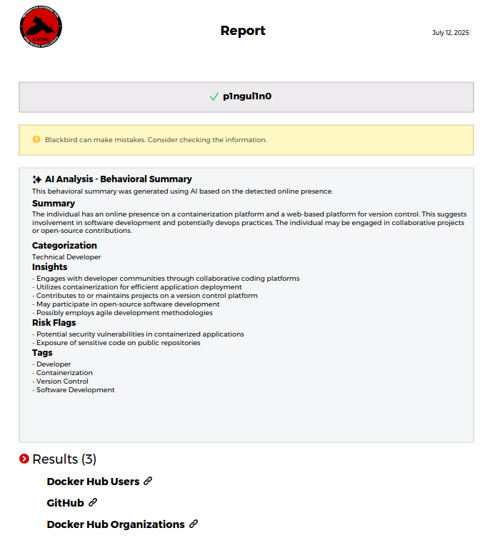

# ✨ AI

<figure><figcaption></figcaption></figure>

Blackbird supports AI analysis to generate behavioral insights based on the sites where a username or email is found.

### 🔧 Setup

To enable AI analysis:

1. Generate an API key:

```bash
python blackbird.py --setup-ai
```

> The API key is stored locally in a file named `.ai_key.json`.

2. Run a search with the `--ai` flag:

```bash
python blackbird.py --username johndoe --ai
```

### 📄 Export

AI-generated summaries are also included in the exported PDF reports.

<figure><figcaption></figcaption></figure>

### 📊 Rate Limits and Quotas

AI usage is **free** but subject to a daily quota.\
Each user can run a limited number of AI-enhanced searches per day. Once the limit is reached, access is temporarily restricted to prevent abuse and ensure fair usage for all users.

### 🔐 Privacy and Data Handling

Blackbird does **not** send any personal or sensitive information to the AI API.\
Only the **names of the discovered sites** are transmitted for analysis.\
No data is stored or retained after the response is generated.

#### Example of data sent to the AI API:

```json
{"prompt": "DigitalOcean, X, Reddit"}
```

### 💬 Questions and Suggestions

If you have suggestions, feedback, or questions about the AI API, feel free to [open an issue](https://github.com/p1ngul1n0/blackbird/issues) on the GitHub repository.

