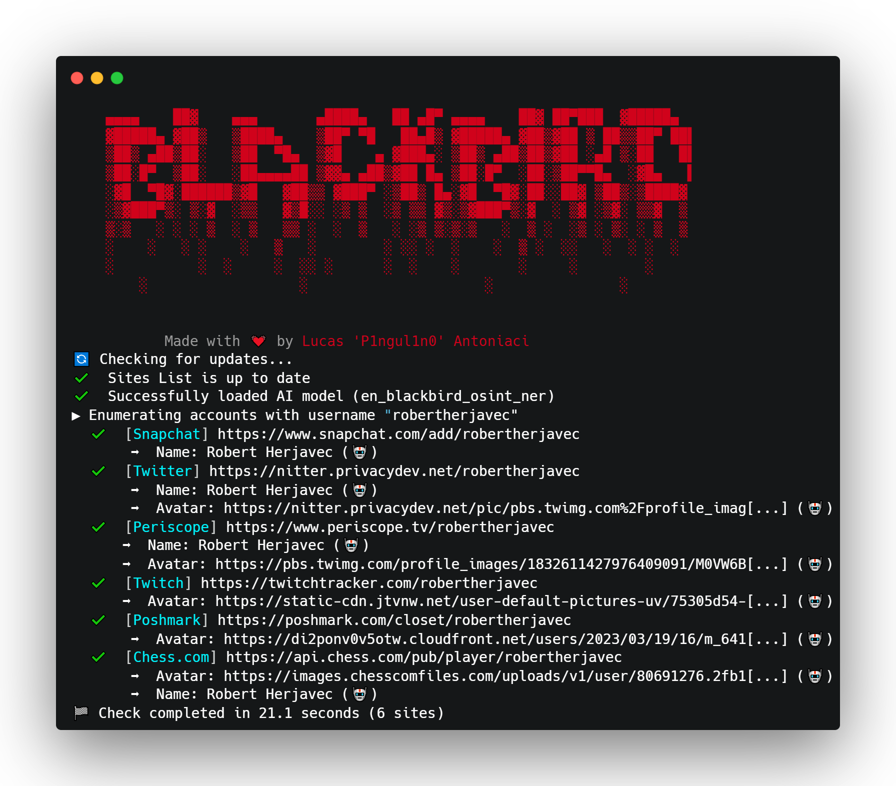

# ✨ AI

<figure><figcaption></figcaption></figure>

Blackbird uses AI-powered NER models to improve metadata extraction, identifying key entities for faster and more accurate insights.

## Setup

#### Install Blackbird NER Model

```bash
pip install en-blackbird-osint-ner
```

## Usage

To utilize the AI-powered model, use the `--ai` parameter when executing the tool.

```bash
python blackbird.py --username p1ngul1n0 --ai
```

Blackbird will automatically extract relevant metadata using AI. Results will be marked with a robot emoji (🤖) next to it for easy identification.

