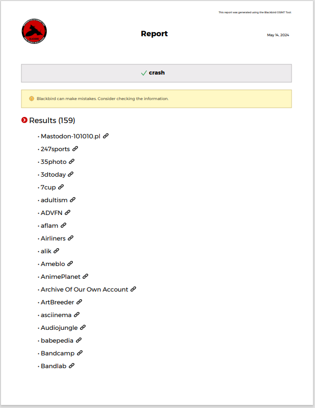

# 🔍 Basic Usage

## 👤 Username Reverse Search&#x20;

```bash
python blackbird.py --username username1 username2 username3
```

## 📧 Email Reverse Search&#x20;

```bash
python blackbird.py --email email1@email email2@email email3@email
```

## 📁 Export

### PDF

```bash
python blackbird.py --username username1 --pdf
```

<details>

<summary>PDF</summary>



</details>

### CSV

```
python blackbird.py --username username1 --csv
```

### DUMP

Dump all found account HTTP responses.

```
python blackbird.py --username username1 --dump
```
